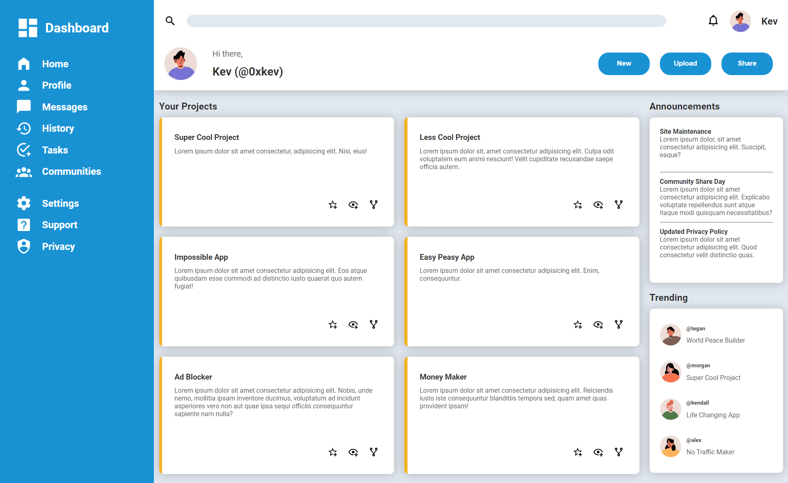

# Admin Dashboard Layout
This is a simple admin dashboard layout built only with CSS Grid

Check it out !

## About the Project
This is a project I created to complete **[The Odin Project](https://www.theodinproject.com/lessons/node-path-intermediate-html-and-css-admin-dashboard)** Design to Code assignment.

This is my own solution. I wrote every line of codes on my own and it got almost pixel perfect to the design file.

## Screenshots
Given Design by TOP

Site Screenshot

## Links
Live Site Url - [Admin Dashboard Layout](https://0xkev21.github.io/admin-dashboard/)

## Built with
- HTML
- CSS (Grid Only)

I didn't use any framework or library proving I have full understanding of the fundamentals.
I only used CSS Grids for this whole layout (No Flex, No Float).

## What I learned
Things I have learnt from this project
- How to build website layouts with CSS Grid
- How to make Grids responsive

## About Me
I am a student trying to be a self-taught developer.
- My profile - [Github](https://github.com/0xkev21/)

---